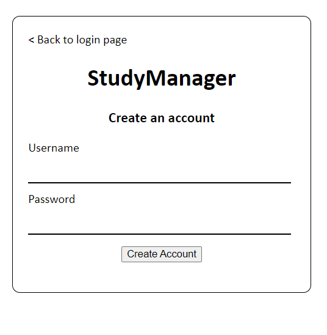
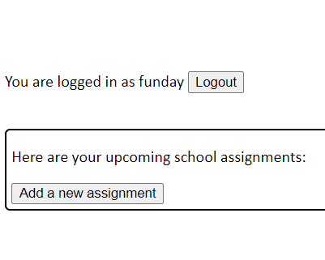
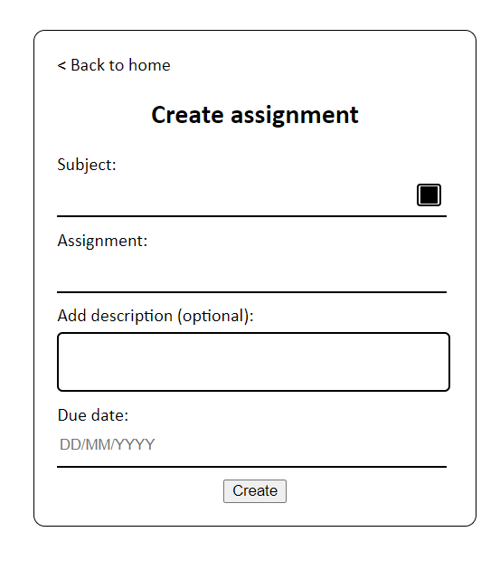
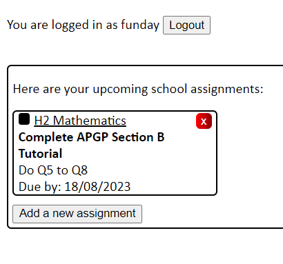

# StudyManager
(WIP) A web application which aims to effectively help students manage their studies through keeping track of assignments and more.

Frontend created using HTML and CSS, while backend is managed by Python utilising the Flask module. Data is stored using SQLite (temporarily).

---
<h2>How to use it?</h2>
<h3><ins>Logging in</ins></h3>

Create an account at "/create_account" and log in from login page:

  

<h3><ins>Adding assignments</ins></h3>

In the home page after logging in, click on the add assignment button at the assignment tab:

  

In "/add_assignment", fill in the subject, subject color, assignment, assignment description and due date of assignment and click the create button:

  

The assignment will then appear on the assignment tab:

  

